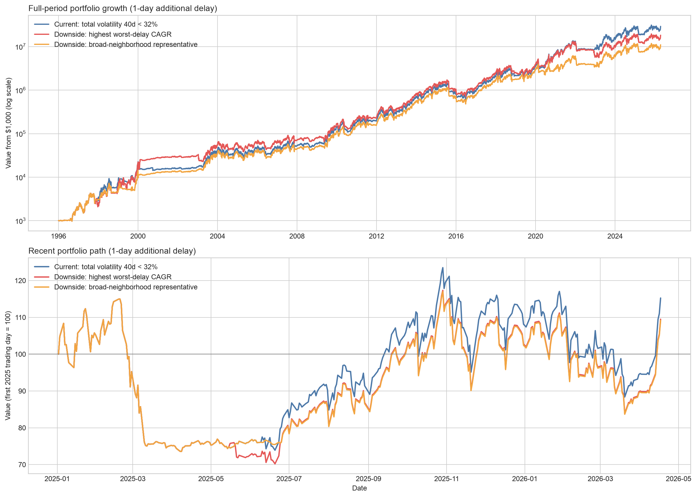
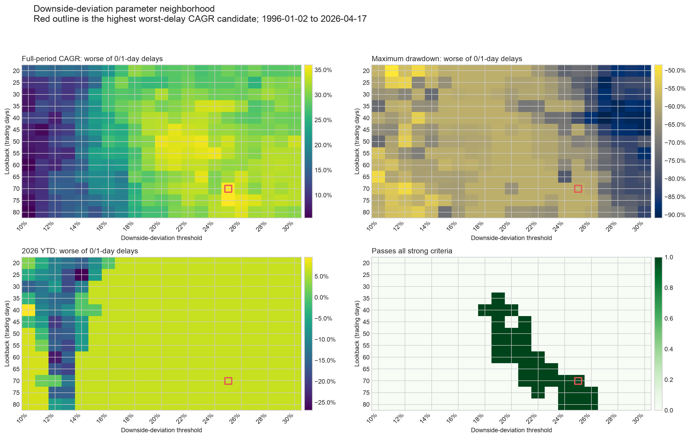
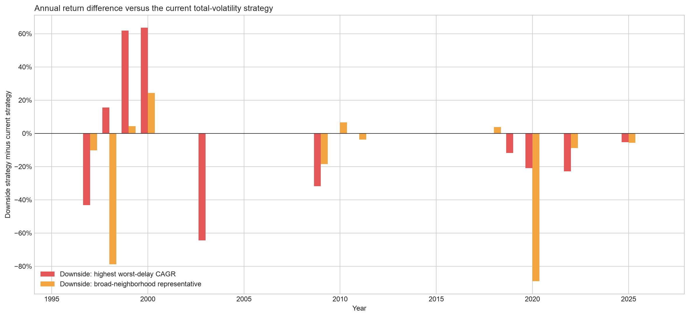

# 採用戦略と下方ボラティリティ検証

## 結論

現時点で採用候補を1つに絞るなら、**総ボラティリティを使うバランス型のNasdaq短期トレンド再エントリー戦略**です。25候補の中で曖昧に選んだのではなく、厳しい条件を通過した25候補のうち、通常執行と1日追加遅延の悪い方の全期間CAGRが最も高かった候補です。

> **採用候補：SPY 150日SMA・上下3%のヒステリシス、Nasdaq-100の40日総ボラティリティ32%未満を基本条件とする。元判定がrisk-offでも、Nasdaq-100が3日SMAを5日連続で上回り、SPYが150日SMAの8%下より上にあり、同じ40日総ボラティリティが32%未満ならTQQQ 100%へ早期復帰する。その他はKMLMSIM・金・VFITXを各1/3とする。**

下方ボラティリティのみを使う指標は**下方偏差（downside deviation / downside semideviation）**です。これへ置き換えた273パラメータを検証しましたが、**2026年の結果は改善せず、全期間CAGRと遅延安定性が悪化したため不採用**です。



図は1日追加遅延の資産推移です。下方偏差案は一部局面で上回りますが、長期では総ボラティリティ案に離され、直近でも2026年の反発捕捉量は変わりません。

## 採用候補の確定ルール

### 通常のrisk-on判定

```text
base_risk_on
  = SPY 150日SMA・上下3%ヒステリシスがrisk-on
    AND Nasdaq-100 40日総ボラティリティ < 32%
```

### risk-off中の早期復帰

```text
early_reentry
  = Nasdaq-100終値 > Nasdaq-100 3日SMA が5取引日連続
    AND SPY終値 > SPY 150日SMA × 0.92
    AND Nasdaq-100 40日総ボラティリティ < 32%
```

`base_risk_on OR early_reentry`ならTQQQ 100%、それ以外はKMLMSIM・金・VFITX各1/3です。当日終値の判定は同日リターンへ適用せず、通常執行では翌取引日、1日追加遅延では翌々取引日から反映します。

## なぜ25候補からこの1つなのか

厳しい合格条件は、全期間CAGR 30%以上、2008年以降CAGR 30%超、2026年YTDプラス、TQQQの2026年上昇の50%以上を捕捉、全期間最大DD -60%以上、Dot-com最大DD -60%以上、0日・1日追加遅延のCAGR差5ポイント以内です。

その条件を満たした25候補の中で、採用候補は**悪い方の全期間CAGR 40.41%で最高**でした。2026年捕捉をさらに優先する3日SMA・4日確認案は、2026年の悪い方が+10.64%まで上がる一方、全期間CAGRの悪い方が38.66%へ低下し、配分変更も96回から120回へ増えます。そのため、総合採用候補は5日確認案とします。

| 指標 | 通常執行 | 1日追加遅延 | 採用判定に使う悪い方 |
|---|---:|---:|---:|
| 全期間CAGR | 40.75% | 40.41% | **40.41%** |
| 2008年以降CAGR | 39.86% | 41.28% | **39.86%** |
| 2026 YTD | +11.01% | +6.58% | **+6.58%** |
| 年率ボラティリティ | 44.86% | 45.14% | **45.14%** |
| 最大DD | -51.56% | -58.91% | **-58.91%** |
| Dot-com最大DD | -23.10% | -37.08% | **-37.08%** |
| 配分変更回数 | 96回 | 96回 | 96回 |

これは**研究上の暫定採用**です。2026年を見て再エントリー規則を選んでいるため、税引後・walk-forward・過去の早期復帰イベント監査が完了するまでは本番資金の確定ルールとは扱いません。

## 下方偏差の定義

今回使った下方偏差は、日次リターンの目標値を0%として、マイナス部分だけを二乗し、指定期間の全観測日で平均して平方根を取り、年率化したものです。

```text
downside_deviation
  = sqrt(mean(min(Nasdaq日次リターン, 0)^2)) × sqrt(252)
```

これはSortino ratioの分母に使われる代表的な下方リスク指標です。プラス方向の大きな値動きをリスクとして数えない点が、通常の標準偏差による総ボラティリティとの違いです。

40日総ボラティリティ32%と最も近いrisk-on比率になる下方偏差は概ね22～24%でした。ただし、同じ32%をそのまま使うと基準が緩すぎるため、期間20～80日を5日刻み、閾値10～30%を1ポイント刻みで検証しました。273候補×0日・1日追加遅延の546ケースです。

## 下方偏差へ置き換えた結果

| 指標（0日・1日追加遅延の悪い方） | 現行：総ボラ40日・32% | 下方偏差でCAGR最大：70日・25% | 下方偏差の広い近傍：55日・20% |
|---|---:|---:|---:|
| 全期間CAGR | **40.41%** | 35.99% | 34.16% |
| 2008年以降CAGR | **39.86%** | 34.70% | 35.17% |
| 2026 YTD | **+6.58%** | +6.58% | +6.58% |
| 年率ボラティリティ | **45.14%** | 48.18% | 44.18% |
| 最大DD | -58.91% | -58.91% | -58.91% |
| Dot-com最大DD | -37.08% | -33.15% | -33.93% |
| 遅延CAGR差 | **0.34pp** | 2.26pp | 1.81pp |
| 平均TQQQ比率 | 67.38% | 70.04% | 65.87% |

下方偏差案にも最低条件を通過する候補は31件ありました。しかし「30%を超えた」だけで、総ボラティリティ案より優れている候補はありません。最大DDや2026年を改善せず、全期間CAGRを4.4～6.2ポイント失っています。



濃緑の合格領域は存在しますが、CAGR最大点の周囲では最大DDが-60%を超える候補も多く、総ボラティリティ案より広く安定した優位性は確認できませんでした。

## なぜ2026年は変わらなかったのか

2026年1月から4月17日までの40日総ボラティリティは13.2～20.8%、40日下方偏差は9.7～15.7%でした。比較した有力閾値ではどちらもほぼ常にリスク許容内です。

したがって2026年の売買時期を決めた主因はボラティリティ条件ではなく、SPYの150日トレンドとNasdaq-100の3日SMA・5日連続確認です。総ボラティリティを下方偏差へ替えても、この期間の再エントリー日は実質的に変わらず、2026年YTDも同じになりました。

## 長期成績が悪化した理由

下方偏差は上方向の大きな値動きを無視するため、急反発を含む不安定な相場で総ボラティリティとは異なるrisk-on判定になります。その違いが長期で一貫した改善にならず、少数年へ大きく集中しました。

1日追加遅延で、CAGR最大の下方偏差案と現行案の年間リターン差は、1999年+61.85ポイント、2000年+63.55ポイントだった一方、1997年-43.15ポイント、2003年-64.35ポイント、2009年-31.87ポイント、2020年-20.96ポイント、2022年-22.84ポイントでした。特定年で大きく勝ち負けする経路であり、安定した改善とは評価できません。



この集中性と、0日・1日追加遅延のCAGR差が0.34ポイントから2.26ポイントへ拡大したことを考えると、下方偏差案は今回の「タイミングに壊れにくい」という目的にも逆行します。

## 最終判断

1. **採用候補は総ボラ40日・32%を使う3日SMA・5日確認・SPY床-8%案。**
2. **TECLは追加しない。** 旧戦略上の検証では2026年問題を解決せず、全期間CAGRも改善しませんでした。
3. **総ボラティリティを下方偏差へ置き換えない。** 2026年は変わらず、CAGRと遅延安定性が低下しました。
4. 次に必要なのは指標追加ではなく、採用候補のwalk-forward、税引後、早期復帰イベント別監査です。

## 出力

| ファイル | 内容 |
|---|---|
| [`test_downside_volatility.py`](test_downside_volatility.py) | 下方偏差273候補の再現コード |
| [`output/downside_volatility_candidate_results.csv`](output/downside_volatility_candidate_results.csv) | 全候補の遅延別結果 |
| [`output/downside_volatility_parameter_grid.csv`](output/downside_volatility_parameter_grid.csv) | パラメータ別の遅延集約結果 |
| [`output/downside_volatility_recommendation.csv`](output/downside_volatility_recommendation.csv) | CAGR最大案と近傍代表案 |
| [`output/downside_volatility_measure_diagnostics.csv`](output/downside_volatility_measure_diagnostics.csv) | 総ボラと下方偏差の判定・2026年レンジ比較 |
| [`output/downside_volatility_selected_paths.csv`](output/downside_volatility_selected_paths.csv) | 現行案・下方偏差2案の日次パス |
| [`output/downside_volatility_annual_returns.csv`](output/downside_volatility_annual_returns.csv) | 年別リターン |
| [`output/downside_volatility_annual_return_differences.csv`](output/downside_volatility_annual_return_differences.csv) | 現行案との差分 |

## 再実行

```bash
uv run --no-project --with pandas --with matplotlib --with numpy --with yfinance \
  python test_downside_volatility.py
```
