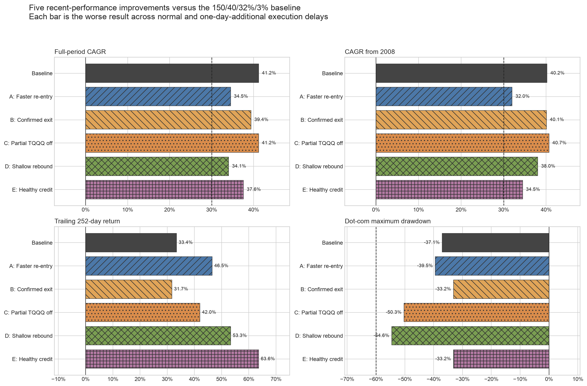
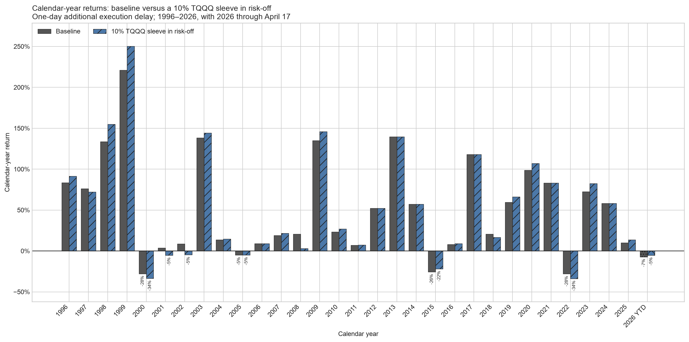
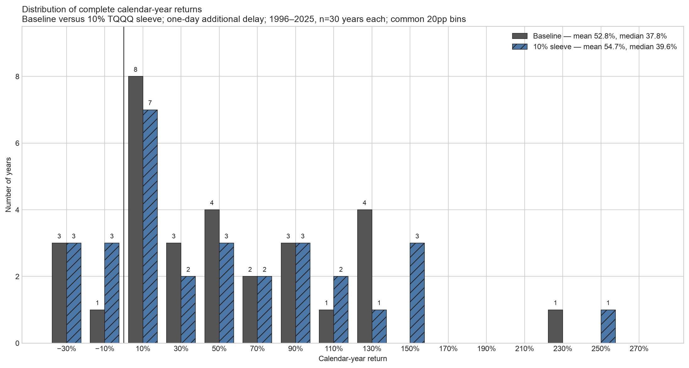
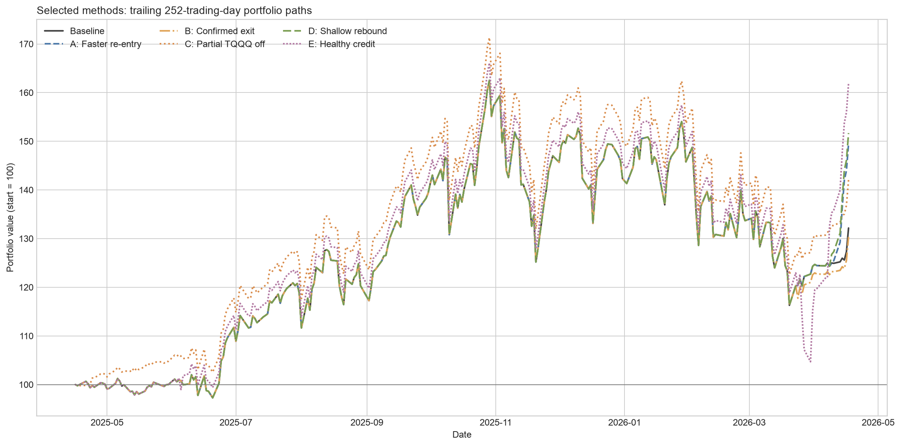
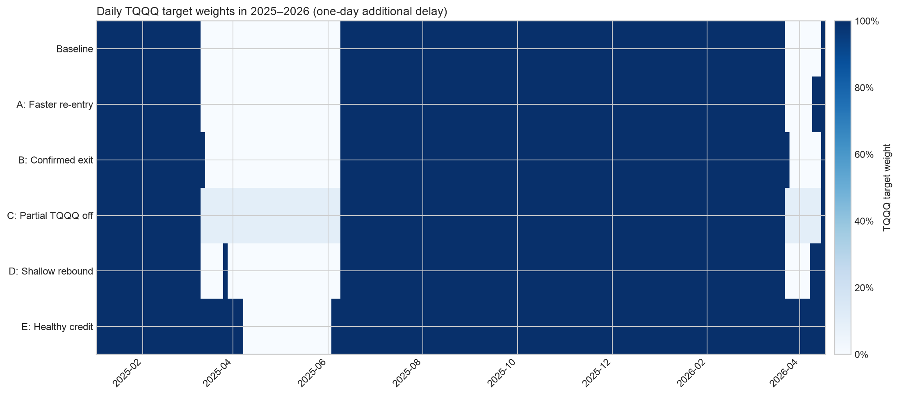
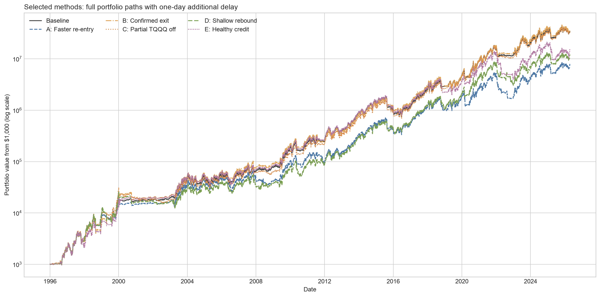

# 直近成績を改善する5手法の比較検証

## 結論

現時点の**実装候補は「リスクオフ中もTQQQを10%だけ残す」手法C**です。元の150/40/32%/3%戦略を大きく作り替えず、0日・1日追加遅延の悪い方で、全期間CAGRを41.20%から41.18%にほぼ維持しながら、直近252取引日リターンを33.41%から42.00%へ改善しました。

手法Cの配分は次のとおりです。

| 状態 | 配分 |
|---|---|
| 元戦略がリスクオン | TQQQ 100% |
| 元戦略がリスクオフ | TQQQ 10%、KMLMSIM 30%、金 30%、VFITX 30% |

ただし2026年1月1日〜4月17日は、悪い方の遅延ケースでまだ-5.63%です。「2026年をプラスへ戻す」ことだけを優先するなら手法DまたはEが効きましたが、長期CAGR、最大ドローダウン、複雑性、将来のデータ入手可能性の代償が大きいため、現時点では採用を推奨しません。

## 5手法の結果

下表は各候補について、通常執行と1取引日追加遅延のうち悪い方を表示しています。期間は1996年1月2日〜2026年4月17日、直近252取引日は2025年4月16日〜2026年4月17日です。2026年は4月17日までの部分年です。

| 手法 | 採用パラメータ | 全期間CAGR | 2008年以降CAGR | 直近252日 | 2026 YTD | 年率ボラ | 最大DD | Dot-com DD | 遅延CAGR差 |
|---|---|---:|---:|---:|---:|---:|---:|---:|---:|
| 元戦略 | 150日 / 40日 / 32% / 3% | 41.20% | 40.21% | 33.41% | -7.50% | 44.80% | -59.87% | -37.08% | 0.41pp |
| A 早期再エントリー | 退出-3%、再参入0% | 34.51% | 32.00% | 46.50% | 1.58% | 46.85% | -68.80% | -39.45% | 2.23pp |
| B 退出確認 | リスクオフ条件3日連続 | 39.37% | 40.08% | 31.71% | -8.42% | 46.15% | -59.85% | -33.15% | 2.11pp |
| C リスクオフ部分保有 | リスクオフ時TQQQ 10% | 41.18% | 40.67% | 42.00% | -5.63% | 45.10% | -57.46% | -50.32% | 0.35pp |
| D 浅い下落での反発復帰 | NDX 20日SMA、SPY下限-8%、ボラ上限36% | 34.07% | 38.03% | 53.29% | 6.58% | 48.72% | -65.51% | -54.57% | 2.36pp |
| E 信用環境オーバーライド | BAA10Y<2.00pp、SPY下限-8%、ボラ上限44% | 37.58% | 34.46% | 63.60% | 11.32% | 47.24% | -71.66% | -33.15% | 1.57pp |



## 推奨順位

### 1. 手法C：リスクオフ中もTQQQを10%保有

最も単純で、長期成績と1日遅延頑健性をほぼ壊しません。全期間最大DDも元戦略の-59.87%から-57.46%へわずかに改善しました。リスクオフ中の上昇取り逃しを10%だけ回収するため、2025年4月以降の成績も改善しています。

弱点はDot-com期最大DDが-37.08%から-50.32%へ悪化することです。近い候補の20%・30%残しはそれぞれDot-com期に-67.10%・-80.09%まで悪化したため採用しません。10%はこの手法の上限候補であり、より安全側なら5%前後を追加検証すべきです。

### 2. 手法E：信用環境オーバーライド

直近改善だけなら最強でした。元シグナルがリスクオフでも、Moody's Baa社債利回りと10年米国債利回りの差が2.00パーセントポイント未満で、SPYが150日SMAの8%下以内、Nasdaq-100の40日ボラが44%未満ならTQQQへ戻します。

2026年YTDは+11.32%まで改善し、Dot-com期DDも-33.15%でした。一方、2021年11月19日〜2022年12月27日の最大DDが-71.66%となりました。信用スプレッドが低いまま株式のバリュエーション調整が進む局面を防げないためです。この手法は「業績・信用環境が良いなら耐える」というアイデアに近いものの、現時点ではリスクが大きすぎます。

### 3. 手法D：浅い下落での短期反発復帰

元シグナルがリスクオフでも、SPYが150日SMAの8%下以内、Nasdaq-100が20日SMAより上、40日ボラが36%未満ならTQQQへ復帰します。2026年YTDは+6.58%へ改善しました。

ただし全期間CAGRは34.07%、最大DDは-65.51%に悪化し、30年間の総回転率は193.35単位と元戦略の60.76単位の約3.2倍です。税引後ではさらに不利になる可能性が高いため、研究候補に留めます。

### 4. 手法A：早期再エントリー

退出は従来どおりSPYがSMA150の3%下、再参入だけSMA150超えへ早めました。2026年YTDは+1.58%へ改善しましたが、全期間CAGRは34.51%、最大DDは-68.80%へ悪化しました。単純ではありますが、3%許容帯が抑えていた往復売買を再び増やしています。

### 5. 手法B：退出確認

リスクオフ条件が3日連続するまで退出を待ちます。Dot-com期DDは-33.15%へ改善しましたが、直近252日と2026年YTDは元戦略より悪化しました。今回の課題に対する解決策ではありません。

## 元戦略とTQQQ 10%残しの年次リターン比較

次の図は、1取引日追加遅延ケースについて、元戦略と「リスクオフ時もTQQQを10%保有」の各暦年リターンを横並びにしたものです。2026年は4月17日までの部分年なので斜線で区別しています。



完全な暦年である1996〜2025年の30年を同じ20パーセントポイント幅のビンに入れた分布は次のとおりです。2026年YTDは分布から除外しています。



| 指標（1996〜2025年） | 元戦略 | TQQQ 10%残し |
|---|---:|---:|
| 単純平均年次リターン | 52.77% | 54.66% |
| 年次リターン中央値 | 37.83% | 39.58% |
| 年次リターン標準偏差 | 60.46% | 66.89% |
| プラス年 | 26年 | 24年 |
| マイナス年 | 4年 | 6年 |
| 最悪年 | 2022年、-28.02% | 2022年、-33.75% |
| 最高年 | 1999年、220.85% | 1999年、250.18% |

10%残しは平均と中央値をそれぞれ約1.9・1.8パーセントポイント引き上げましたが、標準偏差も約6.4ポイント上昇しました。元戦略では小幅プラスだった2001年と2002年がマイナスへ変わるため、マイナス年は4年から6年へ増えています。

つまりこの変更は、**リスクを一様に下げるものではなく、リスクオフ期間にもNasdaq-100の値動きを少量残して上方・下方の両方の裾を広げるもの**です。2008年は元戦略+20.63%に対して10%残し+3.02%、2022年は-28.02%に対して-33.75%と悪化しました。一方、1999年、2003年、2009年、2020年、2023年など強い上昇年では改善しています。

2026年YTDは元戦略-7.13%に対して10%残し-5.29%で、今回問題視した直近の取り逃しは1.84ポイント軽減しました。ただしプラスには戻っていません。

年別の正確な数値は[`output/baseline_vs_partial10_delay1_annual_returns.csv`](output/baseline_vs_partial10_delay1_annual_returns.csv)、分布要約は[`output/baseline_vs_partial10_delay1_annual_summary.csv`](output/baseline_vs_partial10_delay1_annual_summary.csv)に保存しています。

## 直近パスと配分

次の図は1取引日追加遅延ケースを、直近252取引日の開始値を100として比較したものです。



2025年1月以降のTQQQ目標比率を並べると、各改善案がどの期間に元戦略と異なる判断をしたかを確認できます。濃紺がTQQQ 100%、白が0%、薄い青が部分保有です。



全期間の1日追加遅延パスは次のとおりです。縦軸は対数で、初期資産は$1,000です。



## 検証設計

### 共通の元戦略

- SPY 150日SMA
- 退出・再参入の対称許容帯3%
- Nasdaq-100 40日年率ボラティリティが32%未満
- リスクオンはTQQQ 100%
- リスクオフはKMLMSIM・金・VFITXを各1/3
- 当日終値で判定し、通常は翌取引日、追加遅延ケースは翌々取引日のリターンから反映
- 配分変更と日次リバランスに片道5bp
- TQQQ合成系列には日次3倍複利、費用、校正済み資金調達費を反映

### 候補範囲

| 手法 | 試した範囲 | 候補数 | スクリーン通過数 |
|---|---|---:|---:|
| A 早期再エントリー | 再参入許容帯0%、1%、2% | 3 | 3 |
| B 退出確認 | 2日、3日、5日連続 | 3 | 3 |
| C 部分保有 | リスクオフ時TQQQ 10%、20%、30% | 3 | 1 |
| D 浅い反発 | NDX SMA 10/20/30/50日 × SPY下限5/8/10% × ボラ上限36/40/44% | 36 | 10 |
| E 信用環境 | BAA10Y 1.75/2.00/2.25pp × SPY下限5/8/10% × ボラ上限36/40/44% | 27 | 21 |

合計73候補、遅延を含め146ケースを計算しました。各手法では、次のスクリーンを通過した候補のうち、通常執行・1日追加遅延の悪い方の直近252日リターンが最大のものを表示しています。

1. 全期間CAGR 30%以上
2. 2008年以降CAGR 30%超
3. Dot-com期最大DD -60%以上
4. 0日・1日追加遅延のCAGR差5パーセントポイント以内

Dot-com期-60%はユーザー要件そのものではなく、「near wipeout」を機械的に除くために今回置いた研究上の保守的な境界です。

## Forward PERを直接使わなかった理由

手法Eは**forward PERではありません**。信用環境を示す長期の日次代理変数です。FREDの[`BAA10Y`](https://fred.stlouisfed.org/series/BAA10Y)は1995年以前から利用でき、今回の1996年開始テストを覆います。

Nasdaq-100の公開NTM forward P/Eは現在値や2000年12月以降の月次チャートを確認できますが、Dot-com天井前を含む1996年開始の完全なポイント・イン・タイム系列としては不足します。企業別コンセンサス予想を過去の構成銘柄・ウェイトで再構築するならLSEG I/B/E/SやFactSet等の有料データが必要です。その系列を入手できた段階で、手法Eの信用条件をforward P/Eまたはforward EPS成長条件へ置き換えて再検証すべきです。

## データ品質と検算

- 分析期間: 1996-01-02〜2026-04-17、7,623取引日
- 直近252取引日: 2025-04-16〜2026-04-17
- 2026年YTD: 2026-01-02〜2026-04-17、部分年
- BAA10Y原系列: 1995-01-03〜2026-04-17、8,164行。FREDの欠測表記341行は市場日へ合わせる際に直近公表値で前方補完
- 最終分析フレーム、結果指標、選択パスに欠測なし
- 一般化したウェイト型バックテストが、元戦略の保存済み日次ネットリターンと最大絶対差 `1e-12` 以下で一致することをassertで確認
- baseline、手法C、手法EのCAGR・最大DD・直近252日・2026 YTDを保存済み日次パスから独立再計算し一致を確認
- 図は最終PNGを目視確認済み

## 重要な制約

1. **すべてインサンプル**です。特に各手法の採用値は2025年4月〜2026年4月の改善を目的に同じ期間で選んでいるため、直近成績には強い選択バイアスがあります。
2. 税引後計算は今回まだ含めていません。売買回数が増えるA・Dは、実現益課税を入れると表より不利になりやすいです。
3. BAA10Yはforward PERでも企業業績でもありません。信用リスクが低いこととNasdaq-100の利益成長が強いことは同義ではありません。
4. シミュレーションは2026年4月17日で終了しており、2026年8月11日現在までの市場を含みません。
5. GLDSIM・IEISIMの完全なTestfolio系列ではなく、金・VFITX代理系列を使う既存シミュレーション条件を継承しています。

## 判定

**比較研究としては共有可能、ライブ採用判断には追加検証が必要**です。

現段階では、手法Cを「単純な10%リスクスリーブ」として次の検証へ進めるのが妥当です。次に行うべきなのは5%・7.5%・10%・12.5%の近傍、税引後、コスト2倍、期間分割またはウォークフォワードです。手法Eはforward PERの長期系列を確保できた場合の比較対象として保存し、現在のBAA10Y版をそのまま採用すべきではありません。

## 再現ファイル

- 実行コード: [`explore_recent_performance_methods.py`](explore_recent_performance_methods.py)
- 全146遅延ケース: [`output/recent_improvement_candidate_results.csv`](output/recent_improvement_candidate_results.csv)
- 73候補の遅延集約: [`output/recent_improvement_candidate_robust_summary.csv`](output/recent_improvement_candidate_robust_summary.csv)
- 元戦略と5手法の選択結果: [`output/recent_improvement_selected_summary.csv`](output/recent_improvement_selected_summary.csv)
- 選択6戦略の全日次パス: [`output/recent_improvement_selected_paths.csv`](output/recent_improvement_selected_paths.csv)
- FRED BAA10Y原系列: [`output/data/fred_baa10y.csv`](output/data/fred_baa10y.csv)
- 元戦略対10%残しの年次リターン: [`output/baseline_vs_partial10_delay1_annual_returns.csv`](output/baseline_vs_partial10_delay1_annual_returns.csv)
- 年次分布の要約: [`output/baseline_vs_partial10_delay1_annual_summary.csv`](output/baseline_vs_partial10_delay1_annual_summary.csv)

再実行例:

```bash
uv run --isolated --python 3.12 \
  --with-requirements 20260811_Safer_But_Good_Approaches_Exploration/requirements.txt \
  python 20260811_Safer_But_Good_Approaches_Exploration/explore_recent_performance_methods.py
```
