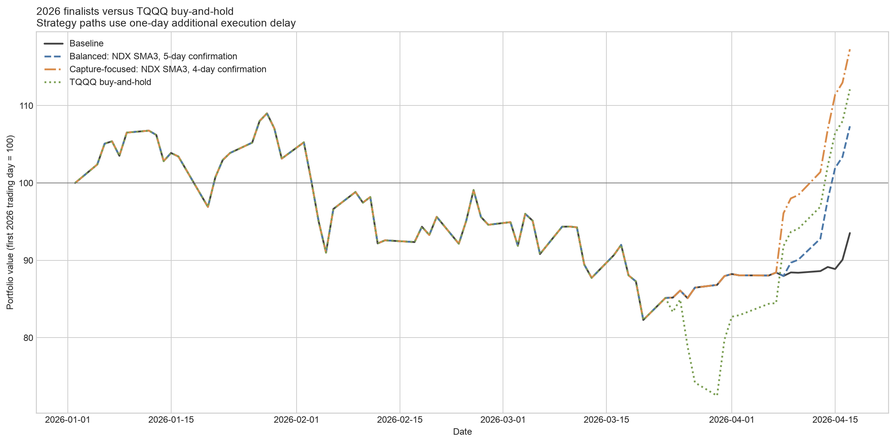
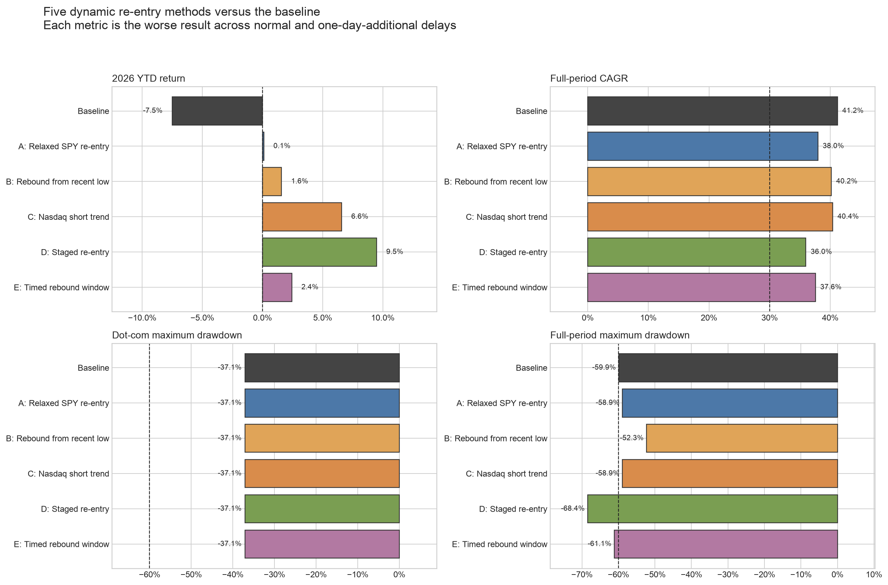
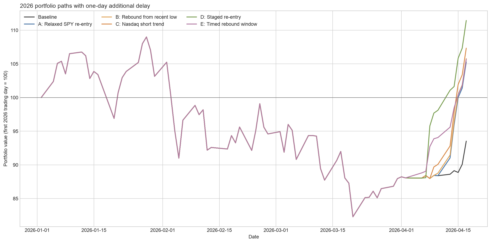
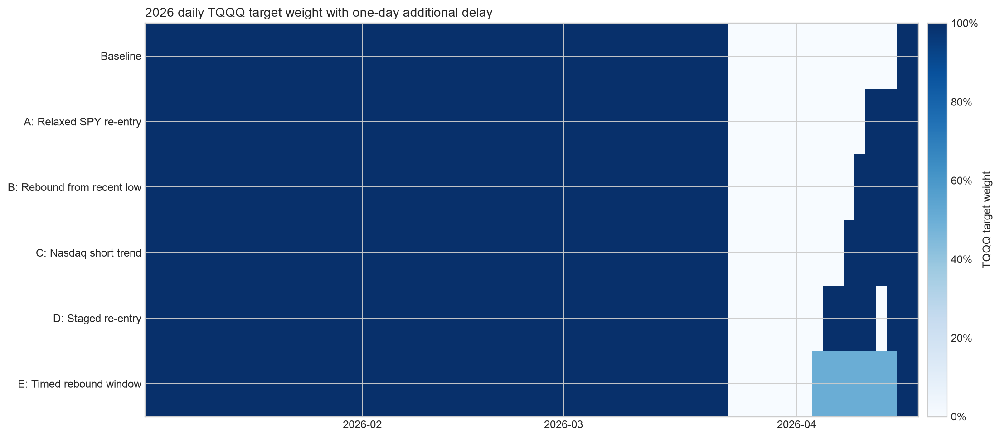
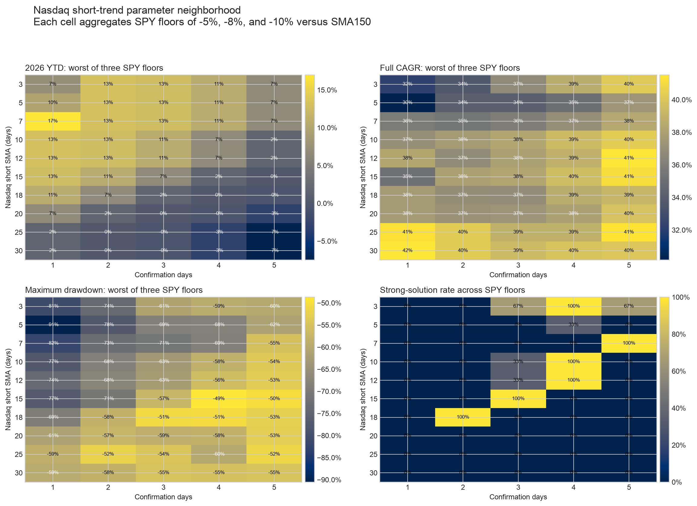

# 2026年のTQQQ反発取り逃しを解決する5種類の再エントリー検証

## 結論

元戦略の2026年YTDが約-7%になった原因は、TQQQが下落している間はrisk-onで保有し、3月24日からの急反発局面でrisk-offになったことです。固定10%スリーブでは反発への配分が小さすぎるため、この問題は解決できませんでした。

そこで、元のrisk-off中だけTQQQへ早期復帰する5種類・221パラメータ候補を作り、元戦略を含む222候補、通常執行と1日追加遅延の合計444ケースを検証しました。

結果として、次のバランス型ルールが現時点の第一候補です。

> **元戦略がrisk-offでも、Nasdaq-100が3日SMAを5取引日連続で上回り、SPYが150日SMAの8%下より上にあり、Nasdaq-100の40日年率ボラティリティが32%未満なら、TQQQ 100%へ早期復帰する。条件を満たさない日は元の防御配分を使う。**

通常執行・1日追加遅延の悪い方で、2026年YTDは**+6.58%**、全期間CAGRは**40.41%**、2008年以降CAGRは**39.86%**、最大ドローダウンは**-58.91%**、Dot-com最大DDは**-37.08%**でした。元戦略の2026年YTD -7.50%を明確に改善し、同期間のTQQQ買い持ち+11.32%の約58%を確保しました。

今回の系列終端は**2026年4月17日**です。本稿の「2026年YTD」は1月から同日までであり、2026年通年リターンではありません。



## 今回の合格基準

「少し改善しただけ」の候補を再び選ばないため、2026年を独立した合格条件にしました。

### 基本合格

1. 通常執行と1日追加遅延の両方で2026年YTDが0%超
2. 両遅延で全期間pre-tax CAGRが30%以上
3. 両遅延で2008年以降pre-tax CAGRが30%超
4. Dot-com最大DDが-60%以上
5. 0日・1日追加遅延のCAGR差が5ポイント以内

### 強い解決策

基本合格に加えて、次も要求しました。

1. 2026年YTDがTQQQ買い持ちの50%以上
2. 全期間最大DDが-60%以上

基本合格は147候補、強い解決策は25候補でした。**強い解決策25件はすべて「Nasdaq短期トレンド」方式から出ています。**

## 共通のシミュレーション条件

- 1996年1月2日から2026年4月17日までの日次系列を使用
- 元戦略のrisk-onはTQQQの長期接続系列100%、risk-offはKMLMSIM・金・VFITXを各1/3
- TQQQ系列には日次3倍複利、経費率・資金調達費用・レバレッジ実装ドラッグを反映
- 防御資産も既存の費用控除後系列を使用
- 目標配分の変化に片道5bpの売買コストを適用
- 当日終値で確定する情報を同日のリターンに使わず、通常執行と1日追加遅延を別々に検証
- 比較対象と5方式は、元戦略のデータ・費用・日次リバランス条件を共通化

## 検証した5方式

### A. SPYの復帰水準を緩める

元戦略はSPYが150日SMAの3%上まで戻るまでrisk-onへ復帰しません。この復帰水準だけをSMA比-3%〜+2%へ緩めました。退出側の元ルールは変えません。

### B. Nasdaqの直近安値からの反発を使う

Nasdaq-100が直近5・10・15・20日の安値から4〜10%反発し、SPYが150日SMAから5〜8%以上下に離れておらず、ボラティリティが32%未満ならTQQQへ戻します。

### C. Nasdaq短期トレンドを使う

Nasdaq-100が3〜30日SMAを1〜5日連続で上回り、SPYが150日SMAから5・8・10%以上下に離れておらず、ボラティリティが32%未満ならTQQQへ戻します。150パラメータを検証しました。

### D. 4条件の一致数で段階復帰する

Nasdaq-100の5日SMA上抜け、5日前比プラス、SPY当日上昇、Nasdaqの3日モメンタムプラスのうち2〜4条件が一致したら、TQQQを50・75・100%保有します。

### E. 短期線上抜け後、期限付きで復帰する

Nasdaq-100が3・5・10日SMAを上抜けたら、5〜20取引日だけTQQQを50・100%保有します。条件を満たし続ける必要のない期間限定方式です。

## 5方式の代表結果

各指標は通常執行と1日追加遅延のうち悪い方です。Cは強い解決策の中で全期間CAGRが最も高い候補、その他は全期間最大DD約-60%を優先しつつ2026年YTDを最大化した候補です。

| 方式 | 代表パラメータ | 2026 YTD | TQQQ捕捉率 | 全期間CAGR | 2008年以降CAGR | 最大DD | Dot-com DD | 遅延CAGR差 | 判定 |
|---|---|---:|---:|---:|---:|---:|---:|---:|---|
| 元戦略 | 150日・40日・32%・3% | -7.50% | -66% | 41.20% | 40.21% | -59.87% | -37.08% | 0.41pp | 2026不合格 |
| A SPY復帰緩和 | SMAの+1%で復帰 | +0.11% | 1% | 37.97% | 35.69% | -58.89% | -37.08% | 1.34pp | 基本合格のみ |
| B 安値から反発 | 20日安値から+8%、SPY床-5% | +1.58% | 14% | 40.19% | 39.82% | -52.27% | -37.08% | 0.40pp | 基本合格のみ |
| C 短期トレンド | 3日SMA上を5日確認、SPY床-8% | +6.58% | 58% | 40.41% | 39.86% | -58.91% | -37.08% | 0.34pp | **強い解決策** |
| D 段階復帰 | 4条件全部一致、100%復帰 | +9.49% | 84% | 35.99% | 33.02% | -68.41% | -37.08% | 3.24pp | 最大DDで不合格 |
| E 期限付き | 10日SMA上抜け後10日、50% | +2.43% | 22% | 37.56% | 33.09% | -61.09% | -37.08% | 0.47pp | 最大DDで不合格 |







## 推奨候補Cのルール

毎日、まず元戦略のrisk-on判定を計算します。

```text
base_risk_on
  = SPY 150日SMA・上下3%ヒステリシスがrisk-on
    AND Nasdaq-100 40日年率ボラ < 32%
```

元戦略がrisk-onなら、従来どおりTQQQ 100%です。

元戦略がrisk-offでも、次の3条件をすべて満たせばTQQQ 100%へ早期復帰します。

```text
early_reentry
  = Nasdaq-100終値 > Nasdaq-100 3日SMA が5取引日連続
    AND SPY終値 > SPY 150日SMA × 0.92
    AND Nasdaq-100 40日年率ボラ < 32%
```

`base_risk_on OR early_reentry`ならTQQQ 100%、それ以外は元のKMLMSIM・金・VFITX各1/3です。当日終値のシグナルを同日リターンへ適用せず、0日遅延は翌取引日、1日追加遅延は翌々取引日から反映します。

## 推奨候補の遅延別成績

| 指標 | 通常執行 | 1日追加遅延 | 悪い方 |
|---|---:|---:|---:|
| 2026 YTD | +11.01% | +6.58% | +6.58% |
| 全期間CAGR | 40.75% | 40.41% | 40.41% |
| 2008年以降CAGR | 39.86% | 41.28% | 39.86% |
| 直近252日 | +60.10% | +53.29% | +53.29% |
| 年率ボラティリティ | 44.86% | 45.14% | 45.14% |
| 最大DD | -51.56% | -58.91% | -58.91% |
| Dot-com最大DD | -23.10% | -37.08% | -37.08% |
| 全期間配分変更回数 | 96回 | 96回 | 96回 |
| 累計回転率 | 102.60 | 102.59 | 102.60 |

比較として元戦略の配分変更回数は54回、累計回転率は約60.75です。推奨候補は30年間で配分変更が42回増えるため、課税口座では税負担が悪化する可能性があります。

## 2026捕捉重視の候補

より2026年を優先するなら、確認を5日から4日に短縮する案があります。

> Nasdaq-100が3日SMAを4日連続で上回り、SPYが150日SMAの5%下より上、ボラティリティ32%未満なら早期復帰。

| 指標 | 通常執行 | 1日追加遅延 | 悪い方 |
|---|---:|---:|---:|
| 2026 YTD | +10.64% | +16.47% | +10.64% |
| TQQQ捕捉率 | 94% | 146% | 94% |
| 全期間CAGR | 38.66% | 41.18% | 38.66% |
| 2008年以降CAGR | 37.78% | 42.16% | 37.78% |
| 最大DD | -59.19% | -58.69% | -59.19% |
| Dot-com最大DD | -23.10% | -37.08% | -37.08% |
| 配分変更回数 | 120回 | 120回 | 120回 |

2026年はほぼ完全に捕捉しますが、全期間CAGRの悪い方が38.66%へ下がり、配分変更も増えます。したがって主推奨ではなく、2026捕捉を最優先する代替候補です。

## パラメータ近傍

短期SMAを3〜30日、確認を1〜5日、SPY床を-5・-8・-10%で検証しました。次の図は各SMA・確認日数について、3つのSPY床の悪い結果または通過率を示します。



強い解決策は25パラメータあり、推奨点だけの単発ではありません。特に次が通過領域です。

- 3日SMA・4日確認：SPY床3種類すべてが強い解決策
- 10日SMA・4日確認：SPY床3種類すべてが強い解決策
- 12日SMA・4日確認：SPY床3種類すべてが強い解決策
- 15日SMA・3日確認：SPY床3種類すべてが強い解決策
- 18日SMA・2日確認：SPY床3種類すべてが強い解決策

ただし、強い領域はSMA日数と確認日数の組み合わせに沿った斜めの帯であり、全パラメータ空間が広く強いわけではありません。これは「短いSMAほど長く確認し、長いSMAほど短く確認する」という同じ実効的な反発確認期間を表している可能性があります。

## 検証の限界

1. **2026年を見てルールを選んでいるためin-sampleです。** 2026年を解決できたことと、今後も同型の反発を取れることは別です。
2. **2026年は4月17日までです。** 通年リターンではありません。
3. **税引後比較は未実施です。** 推奨候補は元戦略より配分変更が増えます。
4. **ファンダメンタル条件は未使用です。** Nasdaq-100の長期フォワードPER・予想EPS系列が手元にないため、価格系列で代用していません。
5. **売買コストは片道5bpです。** 寄付きギャップや市場インパクトは別途必要です。
6. **2026年以外の反発局面を個別分類していません。** Dot-com最大DDと全期間最大DDは確認しましたが、誤った早期復帰がどの過去局面に集中したかは次の監査項目です。

したがって現時点の判定は、**バランス型候補を次段階へ進める価値あり。ただし正式採用前にwalk-forward、税引後、過去の早期復帰イベント監査が必要**です。

## 出力ファイル

| ファイル | 内容 |
|---|---|
| [`test_2026_reentry_5_methods.py`](test_2026_reentry_5_methods.py) | 5方式の再現コード |
| [`output/reentry_2026_candidate_results.csv`](output/reentry_2026_candidate_results.csv) | 222候補×2遅延、444ケース |
| [`output/reentry_2026_candidate_robust_summary.csv`](output/reentry_2026_candidate_robust_summary.csv) | 候補ごとの遅延集約結果 |
| [`output/reentry_2026_selected_summary.csv`](output/reentry_2026_selected_summary.csv) | 5方式の代表候補 |
| [`output/reentry_2026_selected_paths.csv`](output/reentry_2026_selected_paths.csv) | 代表候補の日次パス |
| [`output/reentry_2026_finalist_delay_results.csv`](output/reentry_2026_finalist_delay_results.csv) | 元戦略・バランス型・捕捉重視型の遅延別結果 |
| [`output/reentry_2026_finalist_paths.csv`](output/reentry_2026_finalist_paths.csv) | 最終候補とTQQQの日次パス |
| [`output/reentry_2026_short_trend_neighborhood.csv`](output/reentry_2026_short_trend_neighborhood.csv) | 短期トレンド方式の近傍集約 |

## 再実行

リポジトリの探索フォルダで次を実行すると、444ケースと全CSV・PNGを再生成します。

```bash
uv run --no-project --with pandas --with matplotlib --with numpy --with yfinance \
  python test_2026_reentry_5_methods.py
```
