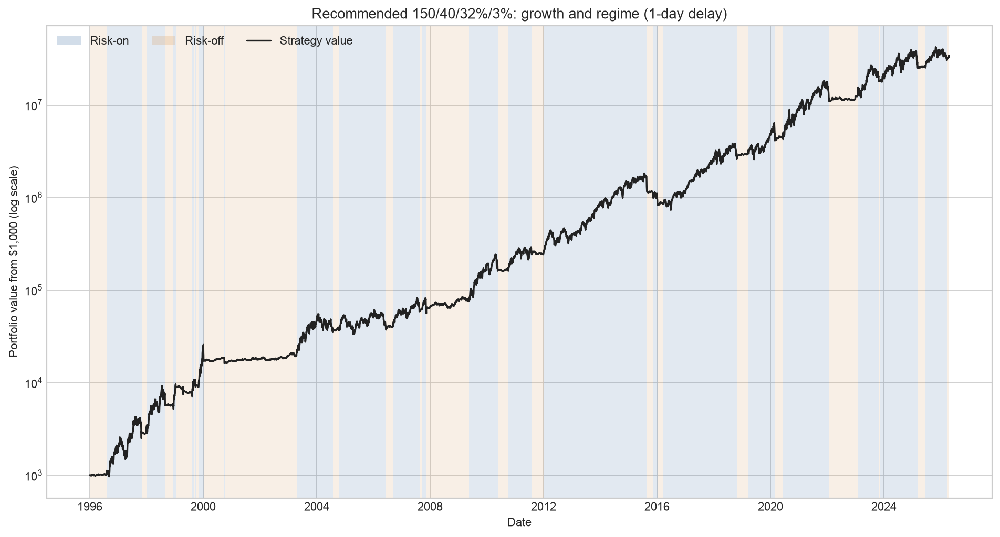
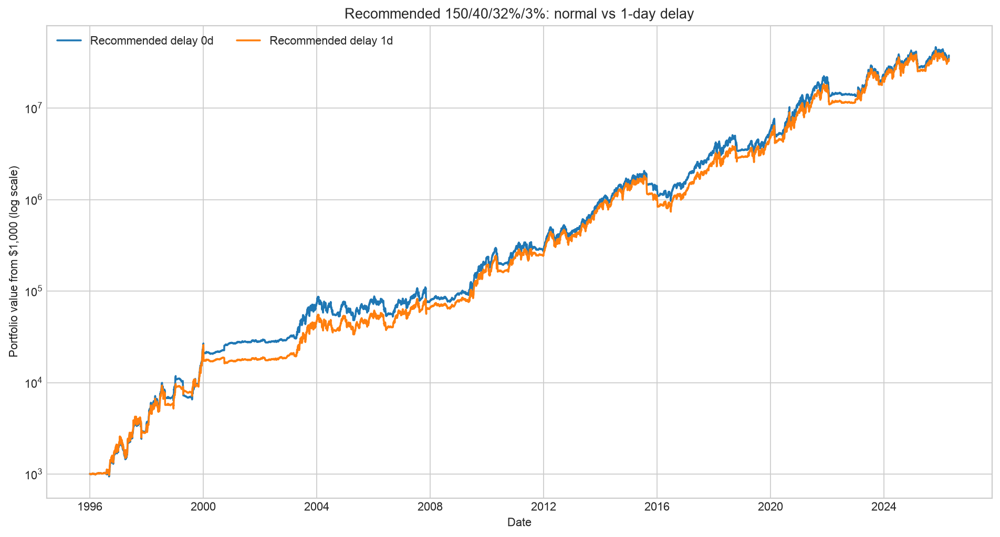
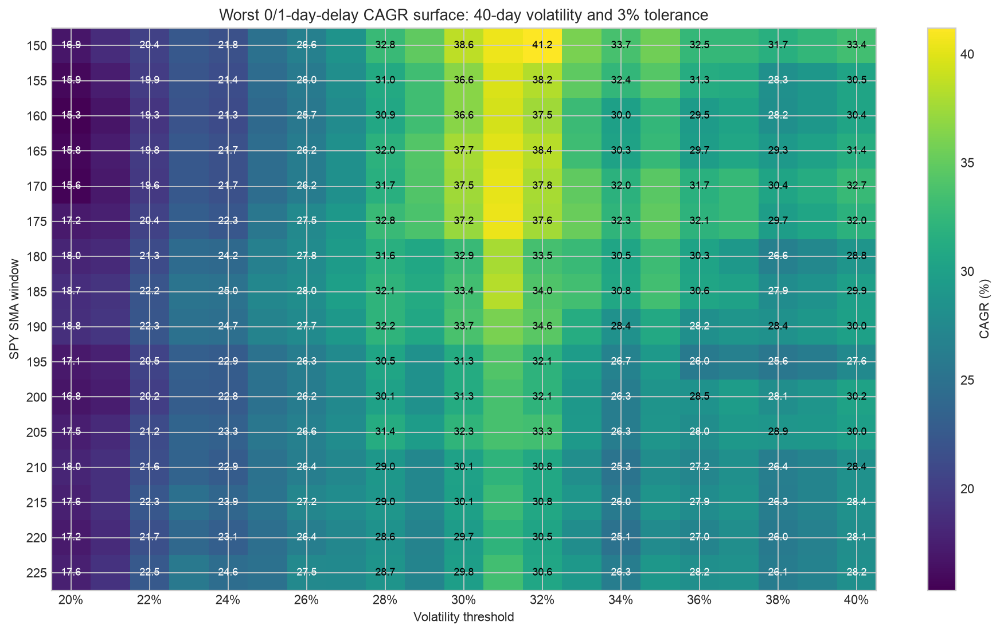
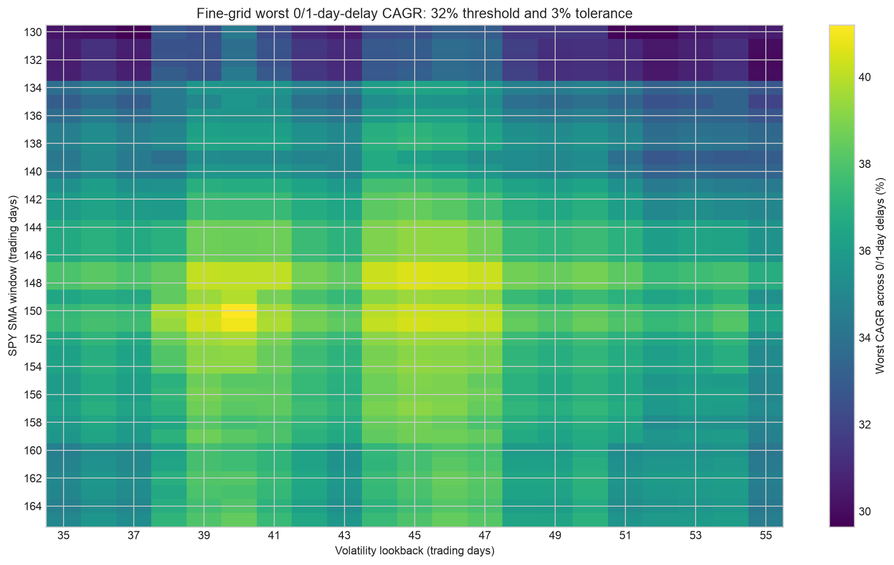

# TQQQ 150/40/32/3レジーム戦略：設計・データ・シミュレーション

## 技術的結論

今回指定した探索範囲と評価基準では、**SPY 150日移動平均・Nasdaq-100 40日ボラティリティ・ボラティリティ閾値32%・許容帯3%** が最良でした。

ここでいう「最良」は、1996年1月2日から2026年4月17日までの同一サンプルにおいて、通常執行と1取引日追加遅延のうち低い方のCAGRを最大化した、という限定的な意味です。将来の最適値を証明したものではありません。

| 指標 | 0日遅延 | 1日追加遅延 |
|---|---:|---:|
| CAGR | 41.61% | 41.20% |
| $1,000最終額 | $37,702,992 | $34,513,311 |
| 年率ボラティリティ | 44.57% | 44.80% |
| 最大ドローダウン | -53.16% | -59.87% |
| Dot-com期最大ドローダウン | -23.10% | -37.08% |
| リスクオン比率 | 66.50% | 66.48% |
| 状態切替回数 | 54回 | 54回 |
| 最悪暦年 | 2022年、-35.72% | 2022年、-28.02% |

1日追加遅延によるCAGR低下は0.41パーセントポイントでした。この意味では執行日の1日差に比較的頑健です。一方、最大ドローダウンは約60%あり、「安全な戦略」ではありません。

## 1日遅延でも長期成長は維持された

次の図は1日追加遅延ケースです。青がTQQQを保有するリスクオン期間、橙がKMLMSIM・金・米国中期国債へ退避するリスクオフ期間、黒線が$1,000からのポートフォリオ価値です。縦軸は対数です。



0日と1日追加遅延を直接比較すると、長期的な経路は近いままです。ただし、短期的な売買位置の差により最大ドローダウンとDot-com期の損失には無視できない差があります。



## 戦略ルール

### 1. SPYによるトレンド状態

SPYの調整後終値を `P_t`、150日単純移動平均を `SMA150_t` とします。許容帯3%は、移動平均の周囲で売買が往復することを抑えるヒステリシスです。

- 現在リスクオフの場合、`P_t > 1.03 × SMA150_t` でリスクオンへ移行
- 現在リスクオンの場合、`P_t < 0.97 × SMA150_t` でリスクオフへ移行
- 97%から103%の帯の中では直前の状態を維持

単純な「終値が移動平均より上か下か」ではなく、状態を持つルールです。

### 2. Nasdaq-100によるボラティリティ判定

Nasdaq-100の日次リターンを `r_t` とし、直近40取引日の標本標準偏差を年率換算します。

```text
vol40_t = std(r_(t-39) ... r_t) × sqrt(252)
```

`vol40_t < 32%` のときだけボラティリティ条件を通過します。

### 3. 最終シグナル

```text
risk_on_t = trend_state_t AND (vol40_t < 32%)
```

つまり、長期トレンドが上向きでもボラティリティが32%以上ならTQQQを保有しません。また、ボラティリティが低くてもSPYの長期トレンドが下向きならリスクオフです。

### 4. 配分

| 状態 | 配分 |
|---|---|
| リスクオン | TQQQ合成・実績接続系列 100% |
| リスクオフ | KMLMSIM 33.33%、金 33.33%、VFITX 33.33% |

リスクオフの3資産は日次で均等配分へ戻します。

### 5. 執行タイミング

当日終値の情報を当日リターンへ適用しません。

- 0日遅延：取引日 `t` の終値で判定し、`t+1` のリターンから新配分を適用
- 1日追加遅延：取引日 `t` の終値で判定し、`t+2` のリターンから新配分を適用

したがって0日遅延も同日終値執行ではなく、通常の翌取引日執行です。

## 使用系列

| 系列 | 保存場所 | 期間・行数 | シミュレーションでの用途 |
|---|---|---:|---|
| TQQQ canonical stitched return | [`../tqqq_backtest/output/tqqq_extension_1991.csv`](../tqqq_backtest/output/tqqq_extension_1991.csv) | 1991-01-02〜2026-04-17、8,887行 | リスクオン収益、Nasdaq-100価格、3か月金利 |
| KMLMSIM total return | [`output/data/testfolio_kmlmsim_daily.csv`](output/data/testfolio_kmlmsim_daily.csv) | 1988-01-04〜2026-08-10、9,723行 | リスクオフ資産 |
| SPY・VFITX・GLD調整後価格 | [`output/data/yahoo_adjusted_prices.csv`](output/data/yahoo_adjusted_prices.csv) | 1995-01-03以降、7,875行 | トレンド、債券、2004年以降の金 |
| Bank of England金価格 | [`output/data/boe_gold_usd.csv`](output/data/boe_gold_usd.csv) | 1995年以降、5,661行 | GLD設定前の金代理系列 |
| 推奨戦略0日遅延パス | [`output/recommended_delay_0_path.csv`](output/recommended_delay_0_path.csv) | 1996-01-02〜2026-04-17、7,623行 | 日次状態、費用、リターン、NAV |
| 推奨戦略1日遅延パス | [`output/recommended_delay_1_path.csv`](output/recommended_delay_1_path.csv) | 1996-01-02〜2026-04-17、7,623行 | 日次状態、費用、リターン、NAV |

### TQQQの1996〜2010年部分

TQQQ設定前はNasdaq-100の日次リターンを使ったdaily-reset 3倍モデルです。

```text
synthetic_return_t
  = 3 × NDX_return_t
  - annual_expense_ratio / 252
  - 0.9133907212 × DGS3MO_t / 252
```

資金調達係数0.9133907212は、2010年以降の実TQQQとの重複期間で累積対数リターンが一致するように校正されています。2010年2月11日以降は実TQQQ調整後価格リターンへ接続します。詳細は[`tqqq_backtest/README.md`](../tqqq_backtest/README.md)を参照してください。

### KMLMSIM

Testfolioの定義に従い、1988〜2020年はKFA MLM Indexから年率0.9%を控除し、2020年以降は実KMLMを使用するトータルリターン系列です。取得方法と一致検査は[`KMLMSIM_CONSTRUCTION.md`](KMLMSIM_CONSTRUCTION.md)に記載しています。

日次丸め系列をローカルで再複利した統計とTestfolioの精密統計は次のとおりです。

| 指標 | ローカル再構築 | Testfolio精密統計 | 差 |
|---|---:|---:|---:|
| CAGR | 7.5140% | 7.5126% | +0.0014pp |
| 最大ドローダウン | -32.0063% | -31.9963% | -0.0100pp |
| 年率ボラティリティ | 14.0643% | 14.0636% | +0.0007pp |

### 金と債券

- 金：2004年11月まではBank of EnglandのUSD金価格からGLD費用相当の年率0.40%を控除し、それ以降はGLD調整後価格を使用
- 債券：VFITX調整後価格を使用

元のTestfolio例にあるGLDSIM・IEISIMそのものではありません。この差は最終認証前に解消すべき残課題です。

## 日次シミュレーション

### リスクオフ配分のリターン

KMLMSIM、金、VFITXの当日リターンを各1/3で合成します。各日の収益後ウェイトと1/3との差から日次リバランス回転率を求めます。

### 売買コスト

片道コストを5bpとします。

```text
cost_t = 0.0005 × (state_switch_t + defensive_rebalance_turnover_t)
net_return_t = gross_return_t - cost_t
```

リスクオン／オフの切替時はフル配分変更を1単位として扱います。防御配分中は3資産を均等配分へ戻すための実際のウェイト差だけを加算します。

### 指標

- CAGR：全期間の複利成長率を実日数で年率換算
- 年率ボラティリティ：日次ネットリターンの標本標準偏差 × `sqrt(252)`
- 最大ドローダウン：累積NAVの過去最高値に対する最大下落率
- Dot-com最大ドローダウン：2000-01-01〜2003-12-31内で同様に計算
- リスクオン比率：全分析日のうちTQQQを保有する日の比率
- 状態切替回数：リスクオン真偽が前日から変化した回数

## パラメータ探索

### 全域走査

| 次元 | 範囲 | 刻み | 候補数 |
|---|---:|---:|---:|
| SPY移動平均 | 150〜225日 | 5日 | 16 |
| ボラティリティ期間 | 20〜80日 | 5日 | 13 |
| ボラティリティ閾値 | 20〜40% | 1pp | 21 |
| 許容帯 | 0〜4% | 1pp | 5 |
| 追加遅延 | 0・1日 | — | 2 |

パラメータは21,840組、遅延を含む評価ケースは43,680件です。全結果は[`output/parameter_grid.csv`](output/parameter_grid.csv)、0日・1日の最低値で集約した結果は[`output/robust_parameter_summary.csv`](output/robust_parameter_summary.csv)に保存しています。

選定目的関数は次です。

```text
score(parameters) = min(CAGR_delay0, CAGR_delay1)
```

150/40/32%/3%の `score` は41.20%で、全域走査の最高値でした。

このヒートマップは、ボラ期間40日・許容帯3%に固定し、移動平均とボラ閾値を変えたときの0日・1日中の最低CAGRです。最高点が孤立しているのではなく、周辺にも高成績領域があります。



### 1日刻み再探索

全域走査の上位がSMA下限150日付近に集まったため、境界バイアス確認として次の細分化探索を追加しました。

- SMA：130〜165日、1日刻み
- ボラ期間：35〜55日、1日刻み
- 閾値：29〜35%、1pp刻み
- 許容帯：2・3・4%
- 遅延：0・1日

31,752ケースを評価しました。結果は[`output/refinement_parameter_grid.csv`](output/refinement_parameter_grid.csv)と[`output/refinement_robust_summary.csv`](output/refinement_robust_summary.csv)に保存しています。

次の図は閾値32%、許容帯3%に固定した細分化面です。SMA 147〜151日・ボラ期間38〜46日付近に連続した高成績領域が確認できます。



## 頑健性の解釈

### 1日遅延では崩壊しなかった

0日から1日追加遅延へのCAGR低下は41.61%から41.20%でした。最終額は約8.5%低下しましたが、30年の複利期間全体で見れば経路は近く、1日の完全なタイミングに依存した結果ではありません。

ただし、Dot-com最大ドローダウンは-23.10%から-37.08%、全期間最大ドローダウンは-53.16%から-59.87%へ悪化しました。CAGRだけで執行頑健性を判断してはいけません。

### 周辺パラメータも機能した

細分化探索の中心周辺であるSMA 144〜152日、ボラ42〜48日、閾値31〜33%、許容帯2〜4%の567組は、全組が0日・1日遅延の両方でCAGR 30%以上でした。

- 最低遅延CAGRの中央値：36.46%
- 10パーセンタイル：34.89%
- 30%以上通過率：100.0%

これは単一点だけの偶然よりは良い証拠ですが、同じ1996〜2026年サンプル内で範囲を選んでいるため、独立したアウト・オブ・サンプル検証ではありません。

## 制約と未実装項目

1. **インサンプル最適化**：150/40/32%/3%は検証期間と同じデータから選択されています。
2. **最大DDが大きい**：1日遅延で-59.87%です。心理的・資金管理上の耐性が必要です。
3. **TQQQ設定前は合成**：1996〜2010年は実際に売買できたETFの価格ではありません。
4. **GLDSIM・IEISIM未再現**：金と債券はローカル代理系列です。
5. **税引後未実装**：税務ロット、取得原価、損失相殺・繰越、最終清算税をまだ計算していません。
6. **費用感応度未完了**：5bp以外の売買コスト、スプレッド、マーケットインパクトは未検証です。
7. **資金調達モデルの不確実性**：過去TQQQ合成系列の校正係数が将来・過去の全局面で一定とは限りません。
8. **KMLMSIM丸め**：取得できる日次リターンは0.001パーセントポイント単位に丸められています。
9. **データ更新差**：Yahoo Finance、Testfolio、Bank of Englandの系列改訂で再実行値が変わる可能性があります。

本結果は投資助言ではなく、研究用シミュレーションです。

## 再現手順

```bash
cd 20260811_Safer_But_Good_Approaches_Exploration
python3 -m venv .venv
source .venv/bin/activate
pip install -r requirements.txt

# KMLMSIMを再取得し、Testfolio統計との一致検査を実行
python download_testfolio_kmlmsim.py

# 全域・細分化探索、CSV、PNG、レポートを再生成
python validate_parameters.py

# 任意：ノートブックを開く
jupyter notebook parameter_validation.ipynb
```

主要な実装は[`validate_parameters.py`](validate_parameters.py)、実行済みノートブックは[`parameter_validation.ipynb`](parameter_validation.ipynb)です。

## 次に必要な検証

1. GLDSIM・IEISIMをTestfolio系列または再現可能な同等系列へ置換する。
2. 期間を固定したウォークフォワード方式でパラメータ選択と評価を分離する。
3. 10bp・20bpのコスト、資金調達係数、TQQQ費用率の感応度を検証する。
4. 税務ロットと損失繰越を実装し、買い持ちTQQQと同じ最終清算条件で比較する。
5. CAGR最大化だけでなく、最大DDやCalmar比を含む複数目的で候補帯を再評価する。

## 出典・利用上の注意

- [Testfolio Help](https://testfol.io/help)：KMLMSIMの定義
- [Bank of England Legal](https://www.bankofengland.co.uk/legal)：データベース再利用条件
- [Yahoo Terms](https://legal.yahoo.com/us/en/yahoo/terms/otos/index.html)：Yahoo由来データの利用条件
- [FRED DGS3MO](https://fred.stlouisfed.org/series/DGS3MO)：3か月米国債利回り

第三者系列の権利は各提供者に帰属します。リポジトリ内のキャッシュは研究再現用であり、商用再配布を意図していません。
