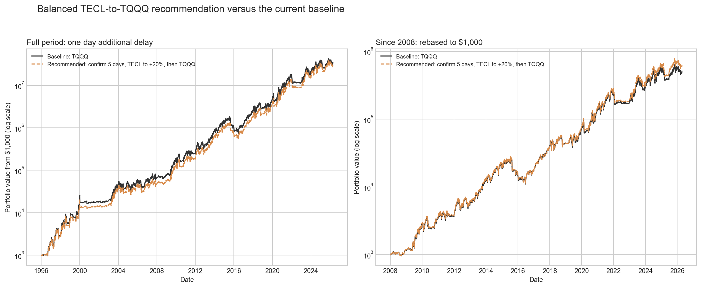
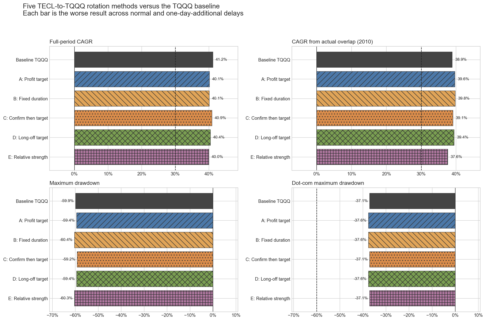
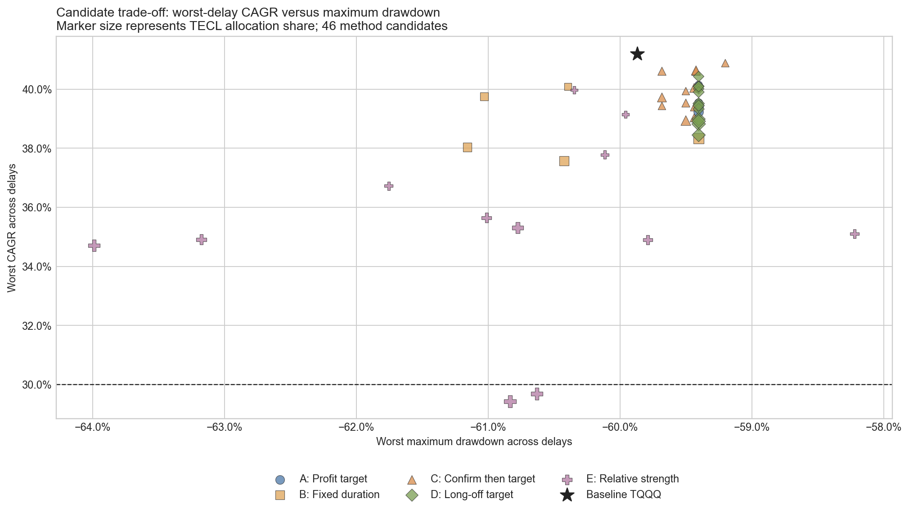
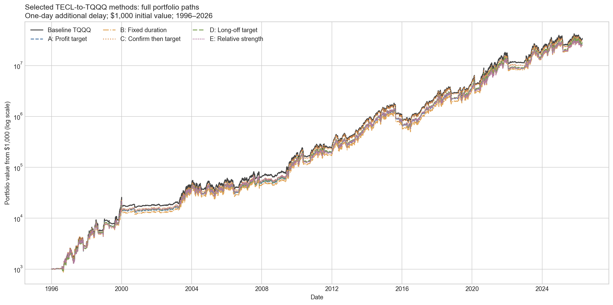
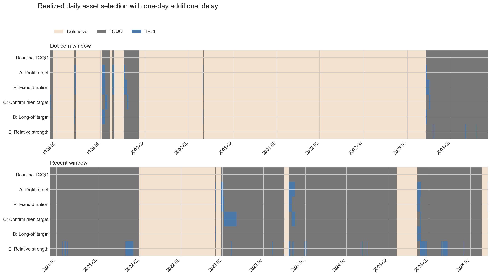

# TECLとTQQQを上昇局面で使い分ける5手法の検証

## 結論

今回の検証では、**元戦略を全面的にTECLへ置き換えるべきではありません**。2010年以降の実ETF共通期間ではTECLの対SPYベータはTQQQより高く、TQQQ上昇日の平均リターンもTECLの方が高かったため、着想の方向性は確認できました。しかし、TECLを元戦略の全risk-on期間で持つと、全期間CAGRは元戦略の41%台から30%台前半へ低下しました。

5手法を46パラメータ組、通常執行と1日追加遅延の合計92ケースで検証したところ、全手法にハード要件を満たす候補がありました。ただし、元戦略を全期間CAGR・2008年以降CAGR・最大ドローダウンのすべてで上回る候補はありませんでした。

現時点の総合候補は次です。

> **元戦略がrisk-onになってから5取引日はTQQQで確認し、その後TECLを保有する。確認時点のTECL基準値から20%上昇したらTQQQへ戻す。元戦略がrisk-offになったら直ちに元の防御資産へ戻す。**

これは全期間CAGRを約0.59ポイント犠牲にする代わりに、2008年以降・2010年以降・直近252日の成績を改善し、追加1日遅延に対するCAGR差を0.08ポイントに抑えました。ただし、まだ全期間を使って選んだin-sample候補であり、元戦略の正式な置き換えではなく追加検証対象です。



## 元戦略

TECL/TQQQの使い分け以外は既存の推奨戦略を変更していません。

| 項目 | ルール |
|---|---|
| 長期トレンド | SPY終値と150日SMA、上下3%のヒステリシス |
| ボラティリティ | Nasdaq-100の40日年率ボラティリティが32%未満 |
| 元のrisk-on | TQQQ 100% |
| risk-off | KMLMSIM・金・VFITXを各1/3、日次均等リバランス |
| 売買コスト | 配分回転率に対して片道5bp |
| 0日遅延 | 当日終値の判定を翌取引日のリターンから反映 |
| 1日追加遅延 | 当日終値の判定を翌々取引日のリターンから反映 |
| 分析期間 | 1996-01-02〜2026-04-17 |

TECL/TQQQの切替は、元戦略がrisk-onの範囲内だけで行います。元戦略がrisk-offなら、どの追加手法でもTECLとTQQQは持ちません。

## 検証した5つのアイデア

### A. 上抜け後、TECLが一定率上昇するまで保有

元戦略がrisk-offからrisk-onへ変わったときにTECLを持ち、risk-on開始時のTECL水準から10・15・20・25・30%上昇したらTQQQへ戻します。ユーザー提案に最も近い単純案です。

### B. 上抜け後、一定日数だけTECLを保有

risk-on開始後の最初の10・20・40・60・80 risk-on日だけTECLを持ち、その後はTQQQへ戻します。利確水準に依存しないため単純ですが、相場の強さを直接見ていません。

### C. risk-onの継続を確認してからTECLを保有

risk-on開始後、最初の2・3・5・10日はTQQQを持ちます。risk-onがその日数続いた場合だけTECLへ切り替え、確認時点から10・20・30%上昇したらTQQQへ戻します。上抜け直後の短い往復を避ける目的です。

### D. 長いrisk-offの後だけTECLを使う

直前のrisk-offが5・10・20・40取引日以上続いた場合だけ、次のrisk-on開始後にTECLを持ちます。その後は10・20・30%上昇でTQQQへ戻します。小さなシグナル往復ではTECLを使わず、長い調整後の反発に限定します。

### E. TECLがTQQQより実際に強い間だけTECLを使う

直近10・20・40・60日のTECLリターンがTQQQを0・2・5%超上回るときだけTECLを持ち、それ以外のrisk-on日はTQQQを持ちます。価格目標ではなく、両ETFの相対的な強さを使う方法です。

## 5手法の代表結果

各行は、その手法の中で**通常執行と1日追加遅延のうち低い全期間CAGRが最大**になる候補です。CAGRは低い方、ボラティリティとドローダウンは悪い方を表示しています。

| 手法 | 採用パラメータ | 全期間CAGR | 2008年以降CAGR | 2010年以降CAGR | 年率ボラ | 最大DD | Dot-com DD | TECL日数比率 | 遅延CAGR差 |
|---|---|---:|---:|---:|---:|---:|---:|---:|---:|
| 元戦略 | TQQQのみ | 41.20% | 40.21% | 38.89% | 44.80% | -59.87% | -37.08% | 0.00% | 0.41pp |
| A 上昇率 | +10% | 40.14% | 40.93% | 39.63% | 44.54% | -59.40% | -37.62% | 4.59% | 0.12pp |
| B 日数 | 10日 | 40.09% | 40.80% | 39.76% | 44.60% | -60.40% | -37.62% | 2.83% | 0.23pp |
| C 確認後上昇率 | 10日確認・+10% | 40.88% | 41.06% | 39.10% | 44.66% | -59.20% | -37.08% | 4.33% | 0.18pp |
| D 長い調整後 | risk-off 40日・+10% | 40.43% | 40.74% | 39.43% | 44.65% | -59.40% | -37.62% | 3.79% | 0.00pp |
| E 相対的な強さ | 20日・5%超 | 39.97% | 38.87% | 37.62% | 44.66% | -60.35% | -37.08% | 3.59% | 0.06pp |









## 総合候補：5日確認・TECL +20%・TQQQへ戻す

手法Cのうち、最高の全期間CAGRだけで選ぶと「10日確認・+10%」です。しかし、今回の着想である「上昇初期にTECLの高い感応度を使い、その後TQQQへ戻す」を保ちつつ、全期間・2008年以降・実ETF共通期間のバランスが良かったのは「5日確認・+20%」でした。

| 指標 | 元戦略・悪い方 | 5日確認/+20%・悪い方 | 差 |
|---|---:|---:|---:|
| 全期間CAGR | 41.20% | 40.61% | -0.59pp |
| 2008年以降CAGR | 40.21% | 41.34% | +1.13pp |
| 2010年以降CAGR | 38.89% | 40.01% | +1.12pp |
| 直近252日リターン | 33.41% | 41.93% | +8.52pp |
| 年率ボラティリティ | 44.80% | 44.68% | -0.12pp |
| 最大ドローダウン | -59.87% | -59.68% | +0.19pp |
| Dot-com最大DD | -37.08% | -37.08% | 0.00pp |
| 2026年YTD | -7.50% | -7.50% | 0.00pp |
| 0日/1日追加遅延のCAGR差 | 0.41pp | 0.08pp | -0.33pp |
| TECL保有日数比率 | 0.00% | 7.20% | +7.20pp |

通常執行と1日追加遅延を個別に見ると次のとおりです。

| 遅延 | 全期間CAGR | 2008年以降CAGR | 2010年以降CAGR | ボラ | 最大DD | Dot-com DD | 直近252日 | 2026 YTD |
|---:|---:|---:|---:|---:|---:|---:|---:|---:|
| 0日 | 40.61% | 41.34% | 40.01% | 44.43% | -53.17% | -23.10% | 41.93% | -7.50% |
| 1日追加 | 40.69% | 42.47% | 41.43% | 44.68% | -59.68% | -37.08% | 43.54% | -7.13% |

追加遅延の方が高成績なのは「遅らせるべき」という意味ではなく、偶然の経路差です。重要なのは1日のずれでCAGRが崩れていない点です。ドローダウンは元戦略と同じく、1日追加遅延の方が大きくなっています。

### ユーザー案をそのまま近似したA：上抜け後TECL +20%

確認期間を入れず、risk-on開始からTECLを持ち、TECL基準値が20%上昇したらTQQQへ戻す案も有効でした。

| 悪い方の指標 | 結果 |
|---|---:|
| 全期間CAGR | 39.53% |
| 2008年以降CAGR | 41.01% |
| 2010年以降CAGR | 39.79% |
| 年率ボラティリティ | 44.44% |
| 最大DD | -59.40% |
| Dot-com最大DD | -37.62% |
| 直近252日 | 46.82% |
| 2026 YTD | -4.71% |
| TECL保有日数比率 | 6.97% |

直近252日と2026年YTDの改善は5日確認案より大きい一方、全期間CAGRは元戦略より約1.66ポイント低くなります。直近だけを改善した候補としては魅力がありますが、総合候補にはしませんでした。

## 「TECLの方がベータが大きい」の確認

### 実ETF共通期間：2010-02-11〜2026-04-17

| 資産 | CAGR | 年率ボラ | 対SPYベータ | TQQQ上昇日の平均日次リターン | TQQQ下落日の平均日次リターン |
|---|---:|---:|---:|---:|---:|
| TECL | 38.98% | 64.99% | 3.488 | +2.643% | -2.859% |
| TQQQ | 42.18% | 61.01% | 3.311 | +2.583% | -2.784% |

この期間では、TECLはTQQQより高ベータ・高ボラで、上昇日も下落日も値幅が大きくなっています。ただしCAGRはTQQQの方が高く、**高ベータだから長期リターンも高い、とは限りません**。

### 合成系列を含む全期間：1996-01-03〜2026-04-17

| 資産 | CAGR | 年率ボラ | 対SPYベータ |
|---|---:|---:|---:|
| TECL | 4.10% | 77.04% | 3.431 |
| TQQQ | 12.80% | 82.03% | 3.590 |

1996年まで延長するとTECLの方が高ベータという関係は逆転します。これは単なる計算誤差ではなく、TECLが米国テクノロジー・セクター指数、TQQQがNasdaq-100という異なる原指数を持つことに加え、設定前合成系列の不確実性も含むためです。この差が、TECL全面置換が長期では不利だった主要な理由です。

## TECL系列の構築と品質

TECLは2008-12-17設定のため、1996年以降の検証には設定前の合成系列が必要です。今回、新しい系列を都合よく作り直さず、リポジトリに保存済みのTECL接続系列を抽出・照合して使いました。

- 1992-08-18〜2026-04-17、8,475行、欠損0、重複日0
- XLK開始前はFSPTX、開始後はXLKを原資産代理とするdaily-reset 3倍モデル
- 年率費用0.87%と校正済み資金調達倍率3.142978を反映
- 2008年末以降は実TECLへ接続
- 実TECLとの日次リターン相関：0.994731
- 実TECLとの日次平均絶対誤差：21.69bp
- 独立した保存済み2系列の共通5,948行における最大差：0.056bp/日

抽出系列は[`output/data/tecl_stitched_return_1992_2026.csv`](output/data/tecl_stitched_return_1992_2026.csv)、品質指標は[`output/tecl_rotation_data_quality.csv`](output/tecl_rotation_data_quality.csv)に保存しています。

TECLはTechnology Select Sector Indexの日次300%を目標とし、TQQQはNasdaq-100の日次3倍を目標とする商品です。いずれも複数日の3倍を保証する商品ではなく、ボラティリティと日次複利により長期実績は単純な3倍から乖離します。商品仕様は[Direxion TECL公式ページ](https://www.direxion.com/product/daily-technology-bull-bear-3x-etfs)と[ProShares TQQQ公式ページ](https://www.proshares.com/our-etfs/leveraged-and-inverse/tqqq)を参照してください。

## 判定基準と合否

候補は次をすべて満たす場合に通過としました。

1. 通常執行・1日追加遅延の両方で、全期間pre-tax CAGRが30%以上
2. 両方で、2008年以降pre-tax CAGRが30%超
3. Dot-com期最大ドローダウンが-60%以上
4. 0日と1日追加遅延のCAGR差が5ポイント以内

今回選んだ5手法の代表候補と総合候補はすべて通過しています。

## 重要な限界

1. **1996〜2008年のTECLは実ETFではありません。** 高い実TECL相関は2008年末以降の重複期間の品質を示すだけで、Dot-com期のTECLリターンを実証するものではありません。
2. **全期間で候補を選んでいます。** 46候補間の比較はin-sampleです。walk-forwardや時系列holdoutを通過するまでは正式採用できません。
3. **+20%は観測系列上の基準値です。** 現行コードはrisk-on開始日または確認日のTECL終値を基準とし、生成済み配分列全体を1日ずらして遅延をテストしています。実売買価格から厳密に+20%を測る執行シミュレーションは次の検証課題です。
4. **税引後比較は未実施です。** TECL/TQQQ間の追加切替は課税口座で利益確定を増やすため、pre-taxの改善がafter-taxで消える可能性があります。
5. **売買コストは5bp固定です。** スプレッド拡大、寄付きギャップ、市場インパクトは明示的にモデル化していません。
6. **2026年は4月17日までです。** 2026 YTDは通年成績ではありません。
7. **TECLとTQQQは同じものの強弱版ではありません。** 原指数・銘柄構成・集中度が異なるため、TECL/TQQQ切替にはベータだけでなくセクター相対リターンの判断も混ざります。

したがってデータ品質の判定は、**追加検証を前提とした利用可**です。合成TECLのDot-com期間を事実として扱わず、実ETF共通期間と合成期間を分けて読む必要があります。

## 出力ファイル

| ファイル | 内容 |
|---|---|
| [`explore_tecl_tqqq_rotation_methods.py`](explore_tecl_tqqq_rotation_methods.py) | 5手法の再現コード |
| [`output/tecl_rotation_candidate_results.csv`](output/tecl_rotation_candidate_results.csv) | 48候補×2遅延、全96ケースの指標 |
| [`output/tecl_rotation_candidate_robust_summary.csv`](output/tecl_rotation_candidate_robust_summary.csv) | 各候補を遅延の悪い方で集約 |
| [`output/tecl_rotation_selected_summary.csv`](output/tecl_rotation_selected_summary.csv) | 元戦略と5手法代表候補 |
| [`output/tecl_rotation_selected_paths.csv`](output/tecl_rotation_selected_paths.csv) | 代表候補の日次資産・費用・リターン・NAV |
| [`output/tecl_rotation_balanced_recommendation_summary.csv`](output/tecl_rotation_balanced_recommendation_summary.csv) | 総合候補の遅延集約指標 |
| [`output/tecl_rotation_balanced_recommendation_delay_results.csv`](output/tecl_rotation_balanced_recommendation_delay_results.csv) | 総合候補の遅延別指標 |
| [`output/tecl_rotation_balanced_recommendation_paths.csv`](output/tecl_rotation_balanced_recommendation_paths.csv) | 総合候補の日次パス |
| [`output/tecl_tqqq_asset_diagnostics.csv`](output/tecl_tqqq_asset_diagnostics.csv) | TECL/TQQQの期間別比較 |
| [`output/tecl_rotation_data_quality.csv`](output/tecl_rotation_data_quality.csv) | TECL系列の品質確認 |

候補総数48には、5手法の46候補に元戦略とrisk-on全期間TECLの2比較対象を含みます。

## 再実行

依存関係に`pandas`、`numpy`、`matplotlib`、`yfinance`が必要です。リポジトリ直下から次を実行します。

```bash
python3 20260811_Safer_But_Good_Approaches_Exploration/explore_tecl_tqqq_rotation_methods.py
```

入力キャッシュが存在する限り、市場データを再取得せず同じ結果を再生成できます。
